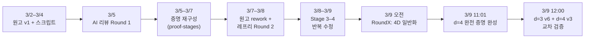

# Research Progression: Hamilton Decompositions of the Directed d-Torus

*Sanghyun Park, March 2–9, 2026 (one week)*

이 문서는 레포지토리의 파일들을 시간순·내용순으로 정리하여,
논문이 어떠한 경로를 거쳐 현재 형태에 이르렀는지를 기록합니다.

---

## 타임라인 요약



---

## Phase 0: 원고 v1 + 탐색 스크립트 (3월 2–4일)

### 핵심 파일
| 파일 | 역할 |
|---|---|
| `tex/d3torus_..._editorial_revision.tex` | 원고 v1 (d=3, m≥3 전체) |
| `anc/route_e_even.py` 등 | 검증 스크립트 번들 |
| `traces/` | 탐색 단계 기록 |

### 이 시점의 논문 상태
- **홀수 m**: affine 5-swap 구성 → 깔끔한 정리
- **짝수 m**: Route E 구성 via return-map 분석 → 작동하지만 "engineered" 느낌
- **m=4**: 유한 witness
- Sign-product parity barrier로 홀짝 분기의 이유를 설명

---

## Phase 1: AI 리뷰 Round 1 — "Minor Revision" (3월 5일경)

### 핵심 파일
| 파일 | 내용 |
|---|---|
| `reviews/review_a.md` | GPT 5.4 Pro 레프리 리포트 A — **Accept after minor revision** |
| `reviews/review_b.md` | GPT 5.4 Pro 레프리 리포트 B — **Minor revision** |
| `reviews/suggestion_c.md` | 구조 제안: **finite-defect piecewise-translation theorem** |
| `reviews/suggestion_d.md` | 구조 제안: **defect monodromy + splice-graph theorem** |

### 핵심 피드백
1. **리뷰 A/B 공통**: 홀수 증명은 우아함. 짝수 증명은 맞지만 "engineered" 느낌. Route E 로드맵, 스플라이스 기법의 조기 노출, 검증 스크립트의 역할 명시가 필요
2. **Suggestion C**: "Route E는 더 큰 정리(finite-defect affine-itinerary theorem)의 instance다. 그 정리를 증명하면 appendix 대부분이 사라진다"
3. **Suggestion D**: advisor-style 로드맵 제시 — **defect height function → arithmetic families → splice graph → monodromy = 하나의 정리**. "증명이 못생긴 게 아니라, 정리가 construction 안에 아직 숨어있는 것"

> **이 시점의 전환**: 단순 polishing이 아닌, 증명의 **추상화 수준을 한 단계 올리는** 방향으로 전환

---

## Phase 2: 증명 재구성 — "Proof Stages" (3월 5–7일)

### 핵심 파일
| 파일 | 내용 |
|---|---|
| `Round2/proof-stages/gemini_deep_think_3.1_draft_1.md` | Gemini 3.1의 첫 재구성 — height-order lemma, critical-lane theory 제시 |
| `Round2/proof-stages/gemini_deep_think_3.1_draft_{2,3}.md` | 후속 초안 |
| `Round2/proof-stages/gpt_5.4_pro_review_progress_1.md` | GPT 5.4 Pro 평가 1: "핵심 casework → 구조정리 전환 **이미 성공**" |
| `Round2/proof-stages/gpt_5.4_pro_review_progress_2.md` | 평가 2: "국소 미학↓, 전역 미학↑ — 올바른 방향" |
| `Round2/proof-stages/gpt_5.4_pro_review_progress_3.md` | 평가 3: "정리는 닫힘. 남은 건 **가장 아름다운 패키징**" |
| `reviews/Proof-revising-progress.md` | 진행 상태 트래커 |

### 증명의 개념적 진화

```
Phase 1: orbit-by-orbit 추적 (casework)
     ↓
Phase 2a: height-order lemma — itinerary가 고정되면 first-return이 affine
     ↓
Phase 2b: critical-lane lemma — arithmetic families가 자동으로 등장
     ↓
Phase 2c: primary-geometry obstruction — "왜 Case II family가 필요한가?"가 theorem으로 승격
     ↓
Phase 2d: noninjectivity theorem — "Case II를 빼면 즉시 깨진다"는 명시적 collision witness
```

**GPT 5.4 Pro의 요약**: "*국소적으로는 덜 예뻐졌고, 전역적으로는 훨씬 예뻐졌다. 그리고 논문으로서는 전역 미학이 더 중요하다.*"

---

## Phase 3: 원고 Rework + Round 2 레프리 (3월 7–9일)

### 핵심 파일
| 파일 | 내용 |
|---|---|
| `tex/d3torus_..._reworked_forced_repair.tex` | rework v1 — "deductive surgery" 서사 도입 |
| `tex/d3torus_..._reworked_forced_repair_v2.tex` | rework v2 — 반복 수정 |
| `Round2/stage4/d3torus_..._v3.tex` | v3 — stage 3–4 피드백 반영 최종 |
| `RoundX/d3torus_..._v5.tex` | v5 — 최종 submission 후보 |

### 레프리 리포트 점수 추이

| Stage | 날짜 | 리포트 | 핵심 판정 | 점수 |
|---|---|---|---|---|
| Stage 1 | 3/7 | `stage1/referee_report_a_s1_compared.md` | "substantive, not merely editorial" | near-accept |
| Stage 2 | 3/7–8 | `stage2/referee_report_a_s2_thinking_deepthink.md` | "6/10 — 수학은 맞지만 exposition이 bottom-up" | 6/10 |
| Stage 3 | 3/9 03:16 | `stage3/referee_report_a_s3.md` | **Accept after minor revision** — 7.5/10 | 7.5/10 |
| Stage 4 | 3/9 04:06 | `stage4/referee_report_a_s4.md` | **Accept after minor revision** — 8/10 | **8/10** |

> **Stage 2 → 4의 핵심 변화**: "even case가 case-driven으로 보인다" → "deductive surgery로 읽힌다. 로드맵이 있다. 아직 appendix가 좀 무겁지만, **publishable**."

### 수정 방향
- **Splice viewpoint를 appendix에서 main text로** 승격
- **4-phase 구조**: universal mechanism → forced obstruction → forced repair → finite splice closure
- 반복 로드맵 프로즈 트리밍
- Appendix 가독성 개선 (테이블 리포맷)

---

## Phase 4: RoundX — d=4 일반화 도전 (3월 9일, 같은 날)

### 핵심 경로

```
codex_job_request.md (06:55)
    → hyperplane fusion search (07:06)
    → codex_job_request_2.md (07:59) — second-return odometer
    → codex_job_request_3.md (09:39) — layer-2 gauge classification
    → d4_line_union_proof_note_draft.md (10:29) — 증명 초안
    → d4_line_union_general_theorem_proof_final.md (11:11) — 완성 증명
```

### 핵심 파일
| 파일 | 내용 |
|---|---|
| `4d_generalization/4d_generalization_memo.md` | 초기 4D 연구 메모 |
| `RoundX/codex_job_request.md` | Codex job 1: hyperplane-fusion search 설계 |
| `RoundX/codex_job_request_2.md` | Codex job 2: second-return odometer 분석 |
| `RoundX/codex_job_request_3.md` | Codex job 3: layer-2 gauge classification |
| `RoundX/d4_line_union_proof_note_draft.md` | 505줄 증명 초안 (Lemma 1–8 + Theorem) |
| `RoundX/d4_line_union_general_theorem_proof_final.md` | 362줄 최종 증명 |
| `RoundX/d4_line_union_general_theorem_proof_final.tex` | LaTeX 버전 |
| `artifacts/4d_generalization/` | 40개의 계산 결과물 (JSON, tar.gz) |

### d=4 증명의 구조
| 단계 | 내용 |
|---|---|
| **Witness** | Line-union gauge: layer 0에서 q=0일 때 (3,2,1,0), 아닐 때 (1,0,3,2). Layer 2에서 {x₀=0}∪{x₃=0} 위에서만 swap |
| **First return** | R_c = f_c^m on P₀ — 3-branch piecewise affine |
| **Second return** | T_c = R_c^m on Q — 2D map with one defect line |
| **Odometer conjugacy** | 모든 T_c가 O(u,v) = (u+1, v+1_{u=0})에 affinely conjugate |
| **Single cycle** | O는 m² 길이의 단일 순환 → T_c도 단일 순환 |
| **Lift** | Q → P₀ → V: m² → m³ → m⁴ |

> **핵심 돌파구**: single-color hyperplane carry는 이미 작동한다는 것을 발견한 후,
> 4-color 호환 문제를 line-union gauge로 해결. 모든 m≥3에 대한 완전 증명.

---

## Phase 5: 교차 검증 + d=3 v6 마무리 (3월 9일 12시경)

### d=3 v6 개정 (Round2/stage5/)

레프리 Stage 3–4에서 공통으로 지적된 두 가지 핵심 병목을 직접 겨냥한 개정:

| 변경 | 내용 |
|---|---|
| Appendix B 확장 | 압축됐던 derivation 3개 (color 2 Case I, color 0/2 Case II)에 explicit trace table 추가 |
| Proposition 13 투명화 | 가장 어려운 row (color 0, Case II)에 worked splice derivation 추가 |
| 홀수 증명 가독성 | F₀ 공식의 유도 과정 (low-layer deviation) 추가 |
| 증명 vs 검증 명확화 | Appendix B–C = 증명의 일부, 스크립트 = 독립 감사 |
| 보조 문서 동기화 | anc/ 내 stale 참조 제거 (anc_v3.zip) |

### d=4 증명 v3 — AI 교차 검증

d=4 line-union proof를 GPT 5.4 Pro와 Gemini 3.1 Deep Think가 독립적으로 검토:

| 이슈 | GPT 5.4 Pro | Gemini 3.1 DT | 심각도 |
|---|---|---|---|
| S=2, q≠0 witness 미정의 | ✅ | ✅ | 정의 누락 |
| **Prop 5–6 lifting 논리 갭** | **✅ + 수정안** | ❌ 놓침 | **실질적 갭** |
| q 변수명 충돌 (t=qm+r) | ❌ | ✅ | 표기 |
| Swap 교환성 미명시 | 간략 언급 | ✅ | 미학 |

v3에서 모든 이슈 수정 완료. 핵심 수정: Prop 5–6의 counting argument를 **exact orbit-period lifting**으로 교체.

### 핵심 파일
| 파일 | 내용 |
|---|---|
| `Round2/stage5/d3torus_..._v6.tex` | d=3 원고 v6 |
| `Round2/stage5/REVISION_NOTES_v6.md` | v6 개정 노트 |
| `RoundX/d4_line_union_general_theorem_proof_v3.tex` | d=4 증명 v3 (수정 완료) |
| `RoundX/d4_line_union_proof_patch_notes_v3.md` | v3 패치 노트 |
| `RoundX/routex_gpt5.4_pro_review.md` | GPT 5.4 Pro 리뷰 |
| `RoundX/routex_gemini31deepthink_review.md` | Gemini 3.1 DT 리뷰 |
| `RoundX/routex_opus46_opinion.md` | Opus 4.6 비교 의견 |

---

## 전체 서사 요약

| 날짜 | 사건 | 논문의 상태 변화 |
|---|---|---|
| 3/2–4 | 원고 v1 완성 | 결과 맞음, 짝수 증명이 무거움 |
| 3/5 | AI 리뷰 2편 + 구조 제안 2편 | "정리가 construction 안에 숨어있다" — 추상화 방향 제시 |
| 3/5–7 | Gemini + GPT 5.4 Pro 증명 재구성 3라운드 | orbit 추적 → height comparison → finite splice — **개념 압축** |
| 3/7–8 | 원고 rework + 다단계 레프리 | 6/10 → 7.5/10 → 8/10 — **deductive surgery 서사** 확립 |
| 3/9 AM | d=4 일반화 5시간 만에 완성 | line-union gauge + 2중 return map + odometer conjugacy — **D₄(m) 완전 증명** |
| 3/9 12:00 | d=3 v6 개정 + d=4 v3 교차 검증 | Appendix B/Prop 13 확장, Prop 5–6 논리 갭 수정 — **양쪽 모두 완성** |

**일주일 만에**: d=3 original theorem → 개념적 재구성 → publishable manuscript → d=4 완전 증명 → 교차 검증까지.

---

## AI 도구 사용 내역

| 도구 | 역할 |
|---|---|
| **GPT 5.4 Pro** | 레프리 리포트, 증명 방향 제안, 구조 비평, 증명 진행도 평가, Codex job 설계 |
| **Codex 5.3** | 계산 탐색 (hyperplane fusion, gauge classification, line-union validation) |
| **Gemini 3.1 Deep Think** | 증명 재구성 초안 (height-order lemma, critical-lane theory) |
| **Opus 4.6** | 가독성(readability) 검증, 어휘/문체(word usage) 교정, 논리 방어(defense), emotional support, 디렉터리 구조 정리 |
| **Antigravity (Gemini)** | 레프리 리포트 분석, 원고 수정 실행, 레포 정리 |

> *"During the development of this manuscript, the author used GPT-5.4 Pro, Codex 5.3, and Opus 4.6 for exploratory case analysis, candidate proof directions, validation-code assistance, internal critique, and language revision. The author independently reviewed and edited all outputs and takes full responsibility for the final content."*
