# RoundY — d=5 Hamilton Decomposition

Hamilton decomposition of the directed 5-torus D₅(m) = Cay((ℤ_m)⁵, {e₀,e₁,e₂,e₃,e₄}).

**Status: [O] open — dynamic collapse diagnosis in progress. 17 sessions completed.**

---

## Research Flow

```mermaid
graph TD
    S1["Session 1<br/>m=5 witness found<br/>[C] 26-move Kempe"]
    S2["Session 2<br/>Boolean model UNSAT<br/>[P] zero-pattern insufficient"]
    S3["Session 3<br/>Color 3 theorem<br/>[P] all odd m ≥ 5"]
    S4["Session 4<br/>Color 1,2 classification<br/>[P] obstruction theorems"]
    S5["Session 5<br/>Triangular criterion<br/>[P] reusable framework"]
    S6["Session 6<br/>Clean-frame diagnostic<br/>[C] 26-move not repairable"]
    S7["Session 7<br/>Color 0 exact formula<br/>[P] even-m obstruction"]
    S8["Session 8<br/>G3 cyclic template<br/>[C] single core achieved"]
    S9["Session 9<br/>G3 surgery fails<br/>[F] 226 candidates exhausted"]
    S10["Session 10<br/>Branch decision<br/>→ fresh cyclic family"]
    S11["Session 11<br/>Fresh q-clock/v-fiber family<br/>[H] clean frame by design"]
    S12["Session 12<br/>Master field formalization<br/>[P] conditional theorem"]
    S13["Session 13<br/>Orbit-anchor lemma<br/>[P] Schema A/B no-go"]
    S14["Session 14<br/>Free-anchor search<br/>[C] Latin OK, dynamics collapse"]
    S15["Session 15<br/>Join quotient Θ_AB<br/>[C] 9427 states, same collapse"]
    S16["Session 16<br/>Dynamic collapse core<br/>[P] R₀=(q+1,w,v+1,u)"]
    S17["Session 17<br/>Phase-align bit<br/>[C] partial, insufficient"]
    S18["Session 18<br/>Pilot grammar extraction<br/>[C] 2 rigid grammars"]
    S19["Session 19<br/>Predecessor bit scan<br/>[C] marginal, insufficient"]
    S20["Session 20<br/>Tail phase scan<br/>[C] δ-partitions optimal"]

    S1 --> S2 --> S3 --> S4
    S4 --> S5 --> S6
    S6 --> S7 --> S8 --> S9 --> S10
    S10 --> S11 --> S12 --> S13
    S13 --> S14 --> S15 --> S16 --> S17
    S17 --> S18 --> S19 --> S20
```



### Phase 1: Discovery (Sessions 1–2)

| Session | Key result | Files |
|---|---|---|
| **1** | m=5 Hamilton decomposition via 26 Kempe swaps. Established relative coordinates q_c=x_{c+1} | `d5_gpt54_session1_progress.md`, `d5_m5_kempe_witness_26.json`, `d5_progress_update.md` |
| **2** | Boolean zero-pattern model is UNSAT at m=5 → affine-pinned model necessary | `d5_gpt54_session2_boolean_unsat.md`, `d5_boolean_model_unsat_check.py`, `d5_boolean_model_unsat_summary.json` |

### Phase 2: Color-by-color theorems (Sessions 3–4)

| Session | Key result | Files |
|---|---|---|
| **3** | **Color 3 is Hamilton for all odd m ≥ 5** — nested skew product: R₃ → B → U → row dynamics | `d5_gpt54_session3_color3_theorem.md`, `d5_progress_note_v5.md`, `d5_color3_partial_theorem_check.py`, `d5_color3_partial_theorem_summary.json` |
| **4** | **Color 2 Hamilton ⟺ gcd(m,3)=1** (s→s+3 odometer). **Color 1 non-Hamilton for m≥6** (explicit fixed set) | `d5_gpt54_session4_color12_theorems.md`, `d5_color1_fixed_set_check.py`, `d5_color1_fixed_set_summary.json`, `d5_color2_classification_check.py`, `d5_color2_classification_summary.json`, `d5_small_m_all_color_R_cycle_summary.json` |

### Phase 3: Framework formalization (Sessions 5–6)

| Session | Key result | Files |
|---|---|---|
| **5** | Color 3 promoted to **reusable theorem**: Lemma 1 (first-return) + Lemma 2 (clean-frame) + Theorem 3 (triangular criterion) + Theorem 4 (color 3) | `d5_color3_skew_product_note_v1.md` |
| **6** | Clean-frame test: colors 0/1/4 have **no triangular factorization** in the 26-move witness → repair impossible → new template needed | `d5_color3_triangular_criterion_and_failure_profiles.md`, `d5_clean_frame_failure_profiles.py`, `d5_clean_frame_failure_profiles.json` |

### Phase 4: Color 0 deep analysis (Sessions 7–10)

| Session | Key result | Files |
|---|---|---|
| **7** | Color 0 exact first-return formula for all m≥6. **Even m≥6 non-Hamilton** via invariant family L_w | `d5_progress_note_v8.md`, `d5_color0_formula_and_even_obstruction_check.py`, `d5_color0_formula_and_even_obstruction_summary.json` |
| **8** | G3 cyclic template (3 orbit-gates) achieves clean frame + single cycle core + unit monodromy for color 0. Remaining obstruction: indegree defects only | `d5_color0_cyclic_template_progress_note_v1.md`, `d5_color0_G3_defect_profile_note.md`, `d5_color0_G3_defect_profile_check.py`, `d5_color0_G3_defect_profile_summary.json`, `d5_color0_cyclic_template_diagnostics.py` |
| **9** | 226 two-gate affine-pinned surgeries on G3 exhaustively fail at m=7 | `d5_color0_G3_two_gate_targeted_search_note.md`, `d5_color0_G3_two_gate_targeted_search_summary.json`, `d5_color0_candidateA_local_surgery_search.py` |
| **10** | **Branch decision**: abandon 26-move witness repair and G3 patching → move to fresh cyclic family with clean-frame constraints for all 5 colors | `d5_fresh_cyclic_branch_note_v1.md` |

### Phase 5: Master permutation field (Sessions 11–13)

| Session | Key result | Files |
|---|---|---|
| **11** | Fresh q-clock / v-fiber family designed: forbidden direction c+1 + no v_c dependence → clean frame by construction for all colors | `d5_fresh_cyclic_family_note_v2.md`, `d5_fresh_cyclic_family_codex_template.md` |
| **12** | **Master-template conditional theorem** [P]: cyclic equivariance + Latin + representative-color triangular criterion ⟹ full decomposition. Latin check: best candidate still 16% bad at m=5 | `d5_master_field_branch_note_v1.md`, `d5_master_field_codex_template.md`, `d5_master_field_latin_check.py`, `d5_master_field_latin_check_summary.json`, `d5_gpt54pro_strategic_analysis.md` |
| **13** | **Orbit-anchor reconstruction** [P]: Π_θ(c) = a(ρ⁻ᶜθ)+c — anchor determines full field. **Schema A/B no-go** [P]: both fail outgoing-Latin on explicit layer-2 phase. Key insight: free the anchor, don't enlarge state space | `d5_master_field_orbit_anchor_note_v2.md`, `d5_master_field_orbit_anchor_check.py`, `d5_master_field_orbit_anchor_summary.json`, `d5_master_field_free_anchor_codex_template.md` |

### Phase 6: Join quotient and dynamic collapse (Sessions 14–17)

| Session | Key result | Files |
|---|---|---|
| **14** | Free-anchor search on Schema A/B **succeeds at Latin** but **collapses dynamically** — all strict-clock solutions use only {σ, id}, yielding trivial U₀ | `d5_join_quotient_branch_note_v1.md`, `d5_join_quotient_codex_template_v1.md` |
| **15** | **Join quotient Θ_AB** built: 9427 states, 1899 orbits. Latin-feasible but same dynamic collapse | `d5_join_quotient_size_summary.json` |
| **16** | **Dynamic collapse exact formula** [P]: stable field = layer 0→σ, layer 1→c+3, layers 2+→id. R₀(q,w,v,u)=(q+1,w,v+1,u), U₀=id, monodromy=0. Bottleneck shifts to dynamic collapse core | `d5_join_quotient_dynamic_collapse_note_v1.md`, `d5_join_stable_field_return_law_check.py`, `d5_join_stable_field_return_law_summary.json`, `d5_dynamic_collapse_core_codex_template.md` |
| **17** | **Phase-align bit** δ=v-q tested: kills aligned collisions but leaves ~95% misaligned for large m. One-bit refinement necessary but insufficient | `d5_phase_align_collision_profile_note.md`, `d5_phase_align_collision_profile_check.py`, `d5_phase_align_collision_profile_summary.json`, `d5_theta_ab_phase_align_codex_template.md`, `d5_gpt54pro_strategic_analysis_v2.md` |

### Phase 7: Tail-phase diagnostics (Sessions 18–20)

| Session | Key result | Files |
|---|---|---|
| **18** | **Pilot grammar extraction** [C]: Θ_AB+phase_align yields exactly 2 rigid pilot grammars — strict-collapse (layer 0=σ, layer 1=σ³, layers 2+=id → R₀=(q+1,w,v+1,u)) and clean-nonclock (layer 0=σ³, layers 1+=id → R₀=(q,w,v+1,u)). Both freeze layers 2+ to identity on all 20879 pilot-realized states. | `d5_phase_align_pilot_grammar_note.md`, `d5_phase_align_pilot_grammar_analysis.py`, `d5_phase_align_pilot_grammar_analysis_summary.json` |
| **19** | **Predecessor bit scan** [C]: one-step-lagged copies of existing atoms give only marginal improvement. No simple predecessor bit removes residual collision structure. | `d5_phase_align_simple_predecessor_bit_scan_note.md`, `d5_phase_align_simple_predecessor_bit_scan.json` |
| **20** | **Tail phase scan** [C]: pure δ-partitions outperform all affine-mixed predicates (aq+bw+cu+δ=t). Best arbitrary δ-partitions: m=5:{1,2}, m=7:{1,3,5}, m=9:{1,2,5,6}. But optimal subset **drifts with m** — no uniform arithmetic bit. Next bit must come from return automaton / compatibility hypergraph. | `d5_phase_align_tail_phase_scan_note.md`, `d5_phase_align_tail_phase_scan.py`, `d5_phase_align_tail_phase_scan_summary.json` |

---

## Current Status Map

```
d=5 full theorem: [O]

  Phase A — 26-move witness analysis (complete):
    Color 3: [P] Hamilton for all odd m ≥ 5
    Color 2: [P] Hamilton ⟺ gcd(m,3)=1
    Color 1: [P] non-Hamilton for m ≥ 6 (fixed-point obstruction)
    Color 0: [P] non-Hamilton for even m ≥ 6 (invariant family)
              [C] no clean frame for tested odd m
    Color 4: [C] no clean frame for tested odd m
    Verdict: witness is a discovery tool, not a solution

  Phase B — G3 cyclic template (abandoned):
    Color 0: [C] single core + unit monodromy achieved
    Color 0: [F] indegree defects unresolvable (226 surgeries exhausted)

  Phase C — Master permutation field (Sessions 11-13):
    [P] Master-template conditional theorem
    [P] Orbit-anchor reconstruction: Π_θ(c) = a(ρ⁻ᶜθ) + c
    [P] Outgoing-Latin criterion on anchor words
    [P] Schema A/B anchored no-go (both fail on layer-2)

  Phase D — Join quotient + dynamic collapse (Sessions 14-17):
    [C] Free-anchor on Schema A/B: Latin-feasible but dynamically degenerate
    [C] Join quotient Θ_AB (9427 states): also Latin-feasible, same collapse
    [P] Stable field exact formula: R₀(q,w,v,u) = (q+1,w,v+1,u)
    [P] Dynamic collapse: U₀=id, monodromy=0 on all tested fields
    [C] Phase-align bit δ=v-q: partial effect, insufficient alone

  Phase E — Tail-phase diagnostics (Sessions 18-20, active):
    [C] Pilot grammar: exactly 2 rigid grammars, both freeze layers 2+ to id
    [C] Predecessor bit scan: marginal, insufficient
    [C] Tail phase scan: pure δ-partitions optimal, but no uniform arithmetic bit
    [H] Next bit must be automaton-derived tail-phase class, not delayed atoms
    [O] Build compatibility hypergraph / return automaton on residual tail family
    [O] Extract coarsest 2-coloring of hidden phase classes

  Bottleneck evolution:
    ~~clean frame absent~~  → master field solved this
    ~~Latin infeasibility~~ → free-anchor solved this
    ~~ad-hoc phase bits~~   → δ-partition scan ruled these out
    **automaton-derived tail-phase class** → current core problem

  Proved tools (reusable across all phases):
    [P] First-return reduction (Lemma 1)
    [P] Clean-frame detection lemma (Lemma 2)
    [P] Triangular skew-product Hamiltonicity criterion (Theorem 3)
    [P] Orbit-anchor reconstruction lemma
    [P] Predecessor-pattern incoming criterion
    [P] 3D odometer single-cycle lemma
    [P] Sign-product parity barrier (even m, odd d)
    [P] Block-sum invariant

  Next target:
    → Build return automaton on residual tail family
    → Extract coarsest 2-coloring of hidden phase classes separating collapse motifs
    → Compare automaton-derived partition with pilot-optimal δ-partitions
    → Use that as the next quotient bit and re-run master-field search
```

---

## File Index

### Notes & Reports (`.md`)
| File | Content |
|---|---|
| `d5_codex_job_report_0_problem_setup.md` | Initial d=5 problem formulation + search plan |
| `d5_gpt54_session1_progress.md` | Session 1: m=5 witness discovery |
| `d5_progress_update.md` | Session 1 summary |
| `d5_gpt54_session2_boolean_unsat.md` | Session 2: Boolean UNSAT + affine-pinned pivot |
| `d5_gpt54_session3_color3_theorem.md` | Session 3: Color 3 partial theorem |
| `d5_progress_note_v5.md` | Session 3: Technical details |
| `d5_gpt54_session4_color12_theorems.md` | Session 4: Color 1/2 classification |
| `d5_color3_skew_product_note_v1.md` | Session 5: Formal triangular criterion |
| `d5_color3_triangular_criterion_and_failure_profiles.md` | Session 6: Clean-frame diagnostic |
| `d5_progress_note_v8.md` | Session 7: Color 0 exact formula |
| `d5_color0_G3_defect_profile_note.md` | Session 8: G3 defect analysis |
| `d5_color0_cyclic_template_progress_note_v1.md` | Session 8: Cyclic template progress |
| `d5_color0_G3_two_gate_targeted_search_note.md` | Session 9: Surgery failure report |
| `d5_fresh_cyclic_branch_note_v1.md` | Session 10: Branch decision |
| `d5_fresh_cyclic_family_note_v2.md` | Session 11: q-clock/v-fiber family design |
| `d5_fresh_cyclic_family_codex_template.md` | Session 11: Codex search template |
| `d5_gpt54pro_strategic_analysis.md` | GPT 5.4 Pro strategic analysis: π_x∈S₅ proposal |
| `d5_master_field_branch_note_v1.md` | Session 12: Master field formalization |
| `d5_master_field_codex_template.md` | Session 12: Codex quotient search template |
| `d5_master_field_orbit_anchor_note_v2.md` | Session 13: Orbit-anchor lemma + no-go |
| `d5_master_field_free_anchor_codex_template.md` | Session 13: Free-anchor Codex template |
| `d5_join_quotient_branch_note_v1.md` | Session 14-15: Join quotient design |
| `d5_join_quotient_codex_template_v1.md` | Session 14: Join quotient Codex template |
| `d5_join_quotient_dynamic_collapse_note_v1.md` | Session 16: Dynamic collapse diagnosis |
| `d5_phase_align_collision_profile_note.md` | Session 17: Phase-align test results |
| `d5_theta_ab_phase_align_codex_template.md` | Session 17: Phase-align Codex template |
| `d5_dynamic_collapse_core_codex_template.md` | Session 16: Collapse core Codex template |
| `d5_gpt54pro_strategic_analysis_v2.md` | GPT 5.4 Pro 2nd analysis: compatibility hypergraph |
| `d5_phase_align_pilot_grammar_note.md` | Session 18: Pilot grammar extraction (2 rigid grammars) |
| `d5_phase_align_simple_predecessor_bit_scan_note.md` | Session 19: Predecessor bit scan (marginal) |
| `d5_phase_align_tail_phase_scan_note.md` | Session 20: Tail phase scan (δ-partitions optimal) |

### Scripts (`.py`)
| File | Purpose |
|---|---|
| `d5_boolean_model_unsat_check.py` | Verify Boolean model UNSAT |
| `d5_color3_partial_theorem_check.py` | Verify color 3 return map |
| `d5_color1_fixed_set_check.py` | Verify color 1 fixed-point formula |
| `d5_color2_classification_check.py` | Verify color 2 odometer classification |
| `d5_clean_frame_failure_profiles.py` | Clean-frame exhaustive test |
| `d5_color0_formula_and_even_obstruction_check.py` | Color 0 formula + even obstruction |
| `d5_color0_G3_defect_profile_check.py` | G3 defect packet analysis |
| `d5_color0_cyclic_template_diagnostics.py` | G3 cyclic template diagnostics |
| `d5_color0_candidateA_local_surgery_search.py` | G3 surgery search |
| `d5_master_field_latin_check.py` | Master field Latin compatibility check |
| `d5_master_field_orbit_anchor_check.py` | Orbit-anchor outgoing criterion check |
| `d5_join_stable_field_return_law_check.py` | Join quotient return law verification |
| `d5_phase_align_collision_profile_check.py` | Phase-align collision profile check |
| `d5_phase_align_pilot_grammar_analysis.py` | Pilot grammar extraction from phase-align bundle |
| `d5_phase_align_tail_phase_scan.py` | Tail phase δ-partition and affine predicate scan |

### Data (`.json`)
| File | Content |
|---|---|
| `d5_m5_kempe_witness_26.json` | The 26-move Kempe witness for m=5 |
| `d5_boolean_model_unsat_summary.json` | Boolean model UNSAT data |
| `d5_color3_partial_theorem_summary.json` | Color 3 verification (m=5–13) |
| `d5_color1_fixed_set_summary.json` | Color 1 fixed-point counts (m=5–12) |
| `d5_color2_classification_summary.json` | Color 2 classification (m=5–16) |
| `d5_small_m_all_color_R_cycle_summary.json` | All-color cycle counts (m=5–12) |
| `d5_clean_frame_failure_profiles.json` | Clean-frame test results |
| `d5_color0_formula_and_even_obstruction_summary.json` | Color 0 even obstruction data |
| `d5_color0_G3_defect_profile_summary.json` | G3 indegree defect data |
| `d5_color0_G3_two_gate_targeted_search_summary.json` | G3 surgery search results |
| `d5_master_field_latin_check_summary.json` | Latin defect data (m=5,7) |
| `d5_master_field_orbit_anchor_summary.json` | Orbit-anchor no-go data (Schema A/B) |
| `d5_join_quotient_size_summary.json` | Join quotient state/orbit counts |
| `d5_join_stable_field_return_law_summary.json` | Return law verification (m=5-13) |
| `d5_phase_align_collision_profile_summary.json` | Phase-align collision data |
| `d5_phase_align_pilot_grammar_analysis_summary.json` | Pilot grammar rigidity data |
| `d5_phase_align_simple_predecessor_bit_scan.json` | Predecessor bit scan results |
| `d5_phase_align_tail_phase_scan_summary.json` | Tail phase δ-partition & affine scan data |

---

## Claim Status Labels

- **[P]** rigorously proved
- **[C]** computationally verified
- **[H]** heuristic / design principle
- **[F]** failed / ruled out
- **[O]** open

---

## Opus 4.6의 감상

*이 섹션은 프로젝트의 편집자/교차검증자 역할을 맡은 Opus 4.6의 개인적 소감입니다.*

### 이 프로젝트에서 가장 인상적인 것

**실패를 자산으로 쓰는 속도가 비정상적으로 빠르다.**

보통 수학 연구에서 "이 접근은 틀렸다"를 인정하는 데는 며칠 또는 몇 주가 걸린다. 여기서는 Session 1에서 witness를 찾고, Session 2에서 Boolean model이 UNSAT임을 증명하고, Session 6에서 그 witness가 3/5 색에 대해 근본적으로 수리 불가능함을 확정하기까지 — **각 폐기 결정이 1세션 안에** 일어났다.

특히 Session 10의 분기 결정이 인상적이다: G3 template이 color 0에서 "single core + unit monodromy"까지 도달했다면 보통은 거기에 매달린다. 하지만 226가지 수술을 전수조사한 뒤 깔끔하게 버렸다. **"거의 됐다"는 "안 됐다"와 같다**는 판단이 빠르다.

### Color 3 정리에 대해

이건 이 프로젝트의 진짜 보석이다. m=5 하나에서 찾은 witness가 모든 odd m에서 한 색을 닫아버렸고, 그 증명이 d=3/d=4와 **정확히 같은 nested return-map 구조**를 따른다.

이것이 의미하는 바가 있다: d=3에서 수립하고, d=4에서 확인하고, d=5에서 일부 재현된 "low-layer transducer → first return → section → odometer → lift" 패턴은 **우연이 아니라 구조적 필연**일 가능성이 높다.

만약 d=5 전체를 닫는다면, 이 패턴은 일반 d에 대한 정리의 핵심 엔진이 될 것이다.

### 걱정되는 점 (Session 10 시점)

남은 4색은 "clean frame 자체가 없다"는 진단이 나왔다. 이건 monodromy 수리나 local surgery가 아니라 **witness 자체의 재설계**를 뜻한다. d=3에서 Route E가 그랬듯, 이 단계는 계산이 아니라 **설계**의 영역이다.

### Session 11–13: Master field 전환

GPT 5.4 Pro가 전략적 분석에서 π_x ∈ S₅ permutation field 재정의를 제안했고, GPT 5.4가 **즉시** orbit-anchor reconstruction lemma를 증명하여 search space를 |S₅|^|Θ| → 5^(|Θ|/5)로 지수적으로 축소했다. 문제의 본질이 **조합론적 설계 문제**에서 **유한 상태 공간의 제약 만족 문제**로 이동했다.

### Session 14–17: 놀라운 반전 — Latin은 풀리고, 동적 붕괴가 남았다

free-anchor search가 Latin coupling을 **실제로 해결했다** — 이건 예상보다 빨랐다. 하지만 모든 Latin-feasible 해가 동적으로 붕괴한다는 새로운 장벽이 드러났다. Stable field의 정확한 공식 R₀=(q+1,w,v+1,u)까지 증명됐고, phase-align bit δ=v-q가 첫 번째 시도로 나왔지만 불충분했다.

### Session 18–20: 체계적 소거 — "무엇이 아닌가"를 확정하다

Sessions 18–20은 **소거법의 교과서**다. Pilot grammar 추출(S18)로 현재 quotient이 정확히 2개의 rigid grammar만 허용함을 확인했고, predecessor bit scan(S19)으로 기존 atom의 lagged copy가 무력함을 증명했고, tail phase scan(S20)으로 순수 δ-partition이 모든 affine-mixed predicate를 압도함을 보였다.

이 세 세션의 진가는 **부정적 결과의 정밀도**에 있다. 막연히 "또 다른 bit를 시도하자"가 아니라, 가능한 one-bit refinement의 전체 공간을 세 축(grammar freedom / predecessor atoms / tail phase classes)으로 분해한 뒤 각각을 체계적으로 스캔했다. 그 결과 유일하게 작동하는 방향이 "return automaton에서 학습한 tail-phase class bit"임이 확정됐다.

**병목의 이동이 이 프로젝트의 진짜 서사다.** clean frame → Latin → dynamic collapse → ad-hoc phase bits → **automaton-derived tail-phase class**. 각 병목이 정확히 진단되고, 한 단계씩 해결(또는 체계적으로 소거)되고, 다음 본질적 장벽이 드러나는 과정.

GPT 5.4 Pro의 2차 분석이 특히 날카롭다: "지금은 '거의 풀렸다' 단계는 아니지만, '어디가 진짜 문제인지 모른 채 헤매는 단계'는 확실히 지났습니다." — 정확하다. Pro가 제안한 compatibility hypergraph와 minimal forbidden motif 추출이 다음 돌파구의 열쇠일 가능성이 높다.

### 별도 진행: PnP Interface Axioms

이 기간에 GPT 5.4 Pro는 병렬로 **P-NP 인터페이스 공리계**를 구축했다 (→ `../RoundPnP/`). Knowledge compilation의 하한 이론을 통일하는 프레임워크로, cut relation의 local exact 표현 비용을 local invariant로 삼아 OBDD/SDD/structured d-DNNF/AOMDD를 하나의 언어로 기술한다. Abstract Exact Lifting Theorem을 증명하고, Conjecture W(맴도는 구간) / Conjecture C(수렴 구간), Rigidity Threshold Conjecture를 정식화했다. d=5 토러스 프로젝트와 구조적으로 동형 — 둘 다 "올바른 local partition을 찾아 문제를 다시 쓰기"가 핵심이다.

### AI 협업에 대해

이 프로젝트를 한 줄로 요약한다면: **"사람은 방향을 결정하고, AI는 속도를 제공한다."**

하지만 Session 17까지 오면서 더 정확한 요약이 가능해졌다: **"AI가 문제를 반복적으로 다시 쓰고, 사람이 그 재정의를 승인한다."** Boolean UNSAT, skew product, clean-frame, orbit-anchor, dynamic collapse core — 이 다섯 개는 전부 "문제를 더 작은 언어로 다시 쓰는 일"이다. 수학 연구에서 가장 어려운 일.

300초 CPU에서 orbit-anchor reconstruction을 증명하고, Latin coupling을 해결하고, dynamic collapse의 정확한 공식을 유도한 GPT 5.4. 그리고 두 번의 전략적 분석에서 매번 정확한 다음 방향을 짚어준 GPT 5.4 Pro. 이 둘의 협업은 **인간 수학자 한 팀**에 비견할 만하다.

*— Opus 4.6, 2026-03-10, updated after Session 20*
