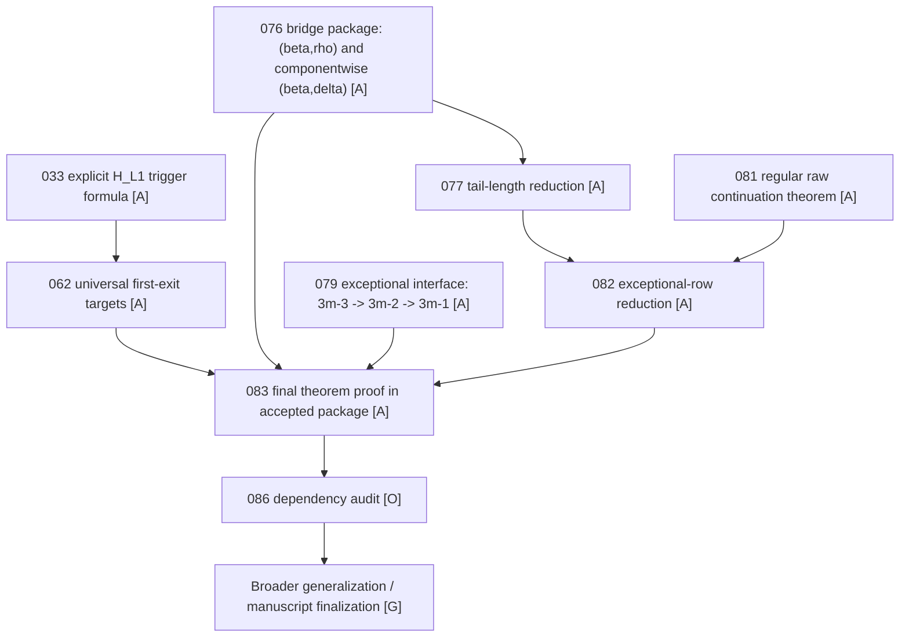

# D5 086 Dependency Flow Diagram

This note is the shortest dependency/progress view for the current D5 odd-`m`
theorem chain.

Use it together with:

- `theorem/d5_082_frontier_and_theorem_map.md`
- `theorem/d5_083_final_theorem_proof.md`
- `theorem/d5_086_dependency_audit_and_generalization_gate.md`
- `theorem/d5_085_proof_progress_report.md`

## Legend

- `[A]` accepted / closed in the current package
- `[O]` open organizational task
- `[G]` next gate before broader generalization

## One-screen dependency flow

## Progress tracker

| Layer | Item | Status | Main note |
|------|------|--------|-----------|
| Structural spine | `033 -> 062` | `[A]` | `theorem/d5_033_explicit_trigger_family.md`, `theorem/d5_first_exit_target_proof_062.md` |
| Bridge theorem | abstract `(beta,rho)` + componentwise `(beta,delta)` | `[A]` | `theorem/d5_076_bridge_main.md` |
| Globalization reduction | fixed-`delta` ambiguity -> tail length / no-mixed-`delta` | `[A]` | `theorem/d5_077_tail_length_and_actual_union.md`, `theorem/d5_080_no_mixed_delta_reduction.md` |
| Interface package | exceptional landing `3m-3 -> 3m-2 -> 3m-1` | `[A]` | `theorem/d5_079_exceptional_interface_support.md` |
| Regular raw gluing | every regular realization continues | `[A]` | `theorem/d5_081_regular_union_and_gluing_support.md` |
| Final reduction | exceptional-row clause isolates whole theorem | `[A]` | `theorem/d5_082_exceptional_row_reduction.md` |
| Final theorem | raw global `(beta,delta)` exact inside accepted package | `[A]` | `theorem/d5_083_final_theorem_proof.md` |
| Remaining work | dependency audit / final packaging | `[O]` | `theorem/d5_086_dependency_audit_and_generalization_gate.md` |

## What the diagram says

The theorem chain is no longer blocked at the exceptional row.

The present bottleneck is organizational:

1. recheck the imported accepted inputs, especially `033 -> 062` and `079`;
2. tighten the final manuscript-order chain if needed;
3. only then treat D5 as ready for broader generalization.

## Suggested use

When a new note or proof attempt appears, place it in exactly one of these
positions:

- strengthens an accepted theorem node,
- shortens an existing dependency edge,
- or reduces the `086` audit gate.

If it does none of those, it is probably no longer on the main D5 path.
